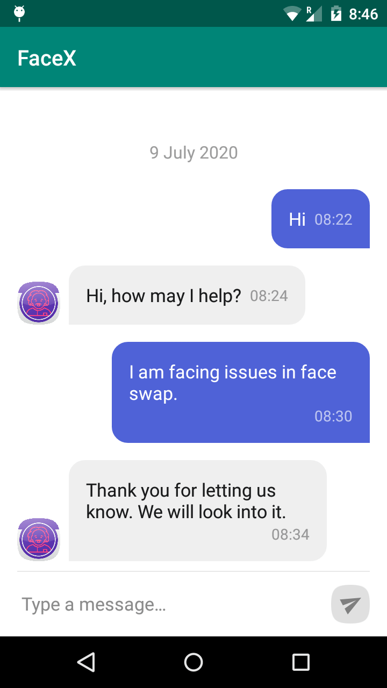
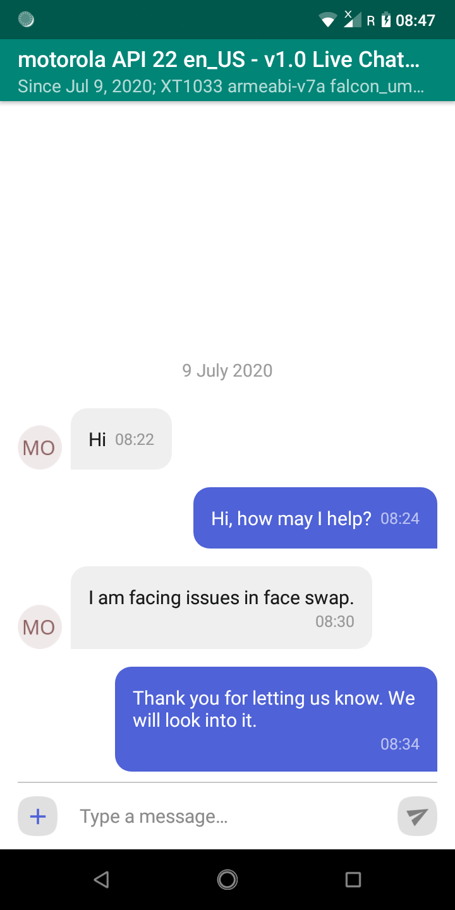

# Live Chat
Easily add in-app chat feature in Android apps using Live ChatKit library. Provide your users a communication channel for feedback and support.

End User | Admin
------------ | -------------
 | 

> Admin view comes from [OwnChat](https://github.com/appsroxcom/OwnChat) which is a chat app built using this library. We recommend you check out that project first.

## How it works
The [demo app](https://github.com/appsroxcom/LiveChatKit/tree/master/app) showcases live chat feature. Adding live chat in your app requires setting up Firebase and integrating chatkit with your project.

To be able to respond to your user messages you will need the OwnChat app configured with the same Firebase project.

## Setup
Step 1: If your app is not already configured with Firebase then follow the instructions given [here](https://firebase.google.com/docs/android/setup).

> At this point we assume you have completed the steps of registering your app with Firebase and adding Firebase configuration file to your app.

Step 2: Now add the library dependency in your app build.gradle:
```
	dependencies {
		implementation 'com.github.appsroxcom:LiveChatKit:4818feb158'
	}
```

Add it in your root build.gradle:
```
	allprojects {
		repositories {
			...
			maven { url 'https://www.jitpack.io' }
		}
	}
```

Step 3: Follow the steps given [here](https://github.com/appsroxcom/OwnChat/blob/master/README.md#setup) for setting up the database and notifications (optional).

## Usage
Copy code present in [demo app](https://github.com/appsroxcom/LiveChatKit/tree/master/app) to your project. You can customize functionality and theme accordingly.

> Tip: You may run the demo app first to get a feel of the application.

To launch live chat screen invoke
```
MessagesActivity.startChatWith(getString(R.string.agent_user_id), this);
```

Here ```agent_user_id``` is the Firebase user id of the Live agent (Admin). You may fetch the user id using Firebase Remote Config instead of hard-coding in the app.

> Important: You must be able to login with this user id in the OwnChat app. For this enable Email/Password sign-in provider in Firebase console. Then maually create a user in the console with an email and password. Get the user UID from there.

Next, in OwnChat app go to Settings > Admin Login.

## Credits
  * https://github.com/stfalcon-studio/ChatKit


